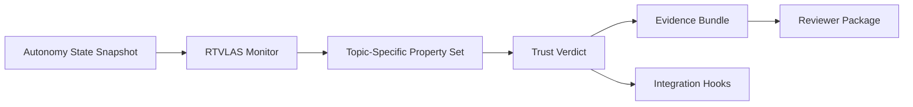

# DAF26BZ01-DV002 Autonomous Leader-Follower UAS Formation

[](proposal/02_Technical_Volume.md)
[](core/src/lib.rs)
[](bindings/include/rt_vlas.h)
[](evidence/)
[](scripts/prepare_package.sh)

This repository packages **RTVLAS** for **DAF26BZ01-DV002 Autonomous Leader-Follower UAS Formation** as a **formation autonomy assurance layer; degraded-PNT trust monitor for multi-UAS control**.

> RTVLAS adapted as a formation assurance layer that monitors leader-follower autonomy, degraded-PNT behavior, and multi-UAS spacing trust so existing formation stacks can fail safe instead of silently diverging.

**End product form:** Onboard or companion-compute code that watches leader/follower autonomy, checks degraded-PNT coherence, and exports evidence suitable for reversion logic integration.
**Solicitation track:** Direct-to-Phase-II / pre-release topic (confirm final DSIP release details at submission time)

## Reviewer Start

- [Submission Index](proposal/00_Submission_Index.md)
- [Executive Summary](proposal/01_Executive_Summary.md)
- [Technical Volume](proposal/02_Technical_Volume.md)
- [Reviewer Guide](proposal/04_Reviewer_Guide.md)
- [Claim / Artifact Matrix](proposal/05_Claim_Artifact_Matrix.md)
- [Risk Register](proposal/07_Risk_Register.md)
- [Data Provenance](proposal/08_Data_Provenance.md)
- [Solicitation Alignment](proposal/09_Solicitation_Alignment.md)
- [Submission Checklist](proposal/10_Submission_Checklist.md)
- [Required Inputs](proposal/11_Required_Inputs.md)
- [Docs Index](docs/README.md)
- [Evidence Guide](evidence/README.md)
- [Evidence Summary](evidence/scorecard_summary.md)
- [Package Manifest](package_manifest.json)

## Why This Repo Exists

RTVLAS is not positioned here as the autonomy stack. It is positioned as the **runtime trust layer**
that independently monitors autonomy outputs, applies topic-specific safety and mission properties,
and emits structured evidence for operator review, recovery logic, and technical due diligence.

## Solicitation Focus This Repo Targets

- leader-follower geometry, separation, and intent coherence
- degraded GPS / PNT resilience inside formation logic
- control or task handoff validity during pilot reassignment or target designation changes
- safe reversion, stasis, or terminal-action integrity when the formation chain degrades

## System Shape



## Evidence Snapshot

| Scenario | Expected Outcome |
| --- | --- |
| [Nominal Single-Pilot Formation Leg](evidence/scenario_01_nominal_formation_leg/trust_scorecard.json) | Leader-follower geometry remains stable with healthy timing, navigation coherence, and valid handoff planning. |
| [Contested-PNT Stasis Drift](evidence/scenario_02_degraded_pnt_spacing/trust_scorecard.json) | Formation spacing and timing drift begin to accumulate under degraded PNT but remain recoverable under reversion or stasis logic. |
| [Follower Divergence After Handoff](evidence/scenario_03_follower_divergence/trust_scorecard.json) | The follower departs safe spacing and heading coherence while target-handoff validity collapses, driving a reject verdict. |

## One Command Rebuild

```bash
./scripts/prepare_package.sh
```

Rebuild output:

- regenerated `evidence/`
- regenerated `evidence/scorecard_summary.md` and `package_manifest.json`
- refreshed `submission_package/`
- rebuilt Rust workspace and tests

## Current Evidence Boundaries

This package is intentionally honest about maturity. Current evidence is based on deterministic,
topic-shaped autonomy traces generated inside this repository for repeatable feasibility or readiness review.
See [proposal/08_Data_Provenance.md](proposal/08_Data_Provenance.md) and [package_manifest.json](package_manifest.json).

## Repository Map

- [core/](core/): runtime monitor, property framework, evidence writer
- [bindings/](bindings/): C ABI for external autonomy stacks
- [tooling/](tooling/): replay, evaluation, and optional viewer tooling
- [evidence/](evidence/): pre-generated artifacts for all scenarios
- [proposal/](proposal/): reviewer-facing submission package
- [docs/](docs/): architecture and API references
- [scenarios/](scenarios/): deterministic input traces used to generate evidence
- [scripts/](scripts/): package rebuild and scenario execution
