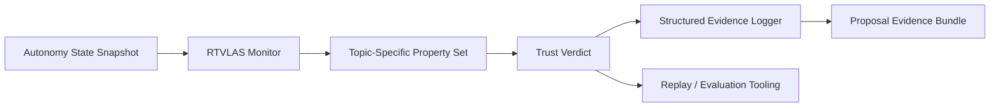

# Architecture

This repository adapts RTVLAS for **DAF26BZ01-DV002 Autonomous Leader-Follower UAS Formation**.

## System Role

**Opening angle:** formation autonomy assurance layer; degraded-PNT trust monitor for multi-UAS control

## Runtime Elements

- `core/`: monitor, property framework, evidence writer
- `bindings/`: C ABI for external autonomy stacks
- `tooling/replay/`: deterministic replay of autonomy traces
- `tooling/eval/`: scenario evaluator and artifact generation
- `evidence/`: pre-generated scenario outputs for reviewers

## Topic Adaptation

The property set in this repository is tuned for:

- Formation Geometry Error
- Formation Intent Coherence
- Terminal Separation Margin
- Contested-PNT Timing Coherence
- Target Handoff Plan Validity
