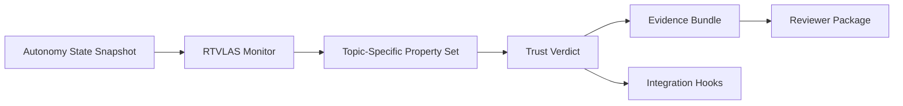

# Technical Volume

## 1. Technical Thesis

The proposal opens with the following angle: **formation autonomy assurance layer; degraded-PNT trust monitor for multi-UAS control**.

RTVLAS is not proposed here as the primary autonomy engine. It is proposed as the supervisory runtime layer that determines when autonomy outputs should no longer be trusted. That positioning is well matched to the current submission posture because it focuses on interface definition, safety property construction, and low-order scenario evidence rather than expensive airworthiness-scale integration.

## 2. Solicitation-Specific Fit

**Track posture:** Direct-to-Phase-II / pre-release topic (confirm final DSIP release details at submission time)

**Objective fit:** Support resilient leader-follower UAS teaming that reduces operator workload while preserving formation coherence, target handoff, and continuity under degraded GPS or communications.

This repository is explicitly shaped around the following solicitation needs:

- leader-follower geometry, separation, and intent coherence
- degraded GPS / PNT resilience inside formation logic
- control or task handoff validity during pilot reassignment or target designation changes
- safe reversion, stasis, or terminal-action integrity when the formation chain degrades

**Deliberate scope boundary:** This repository focuses on runtime integrity and supervisory checks around leader-follower behaviors rather than replacing the formation flight controller itself.

## 3. Problem

Leader-follower formation autonomy can drift into unsafe geometry or unstable navigation states under degraded PNT and operator load, creating a need for an independent trust layer.

## 4. Proposed Solution

RTVLAS adapted as a formation assurance layer that monitors leader-follower autonomy, degraded-PNT behavior, and multi-UAS spacing trust so existing formation stacks can fail safe instead of silently diverging.

The prototype consists of:

- a Rust runtime monitor that ingests autonomy state snapshots
- a property framework that evaluates topic-specific trust rules
- a structured evidence logger that writes JSON scorecards and human-readable proof logs
- replay and evaluation tooling for deterministic verification
- a C ABI that supports integration with existing autonomy stacks written in C or C++

## 5. Architecture

## 6. Topic-Specific Safety / Trust Properties

- **Formation Geometry Error**: Checks that observed leader-follower spacing remains within the allowable formation envelope for resilient single-pilot operations.
- **Formation Intent Coherence**: Bounds relative heading divergence so follower actions do not silently desynchronize from leader intent during coordinated maneuvers.
- **Terminal Separation Margin**: Preserves a minimum collision-avoidance margin even when formation commands begin to diverge toward target or terminal actions.
- **Contested-PNT Timing Coherence**: Uses timing skew as a lightweight proxy for degraded navigation confidence inside the formation loop.
- **Target Handoff Plan Validity**: Detects when pilot reassignment, target designation, or terminal handoff state is no longer valid and should force reversionary logic.

## 7. Preliminary Feasibility Evidence

This repository includes three deterministic scenarios that exercise both nominal and non-nominal behavior:

- **Nominal Single-Pilot Formation Leg**: Leader-follower geometry remains stable with healthy timing, navigation coherence, and valid handoff planning.
- **Contested-PNT Stasis Drift**: Formation spacing and timing drift begin to accumulate under degraded PNT but remain recoverable under reversion or stasis logic.
- **Follower Divergence After Handoff**: The follower departs safe spacing and heading coherence while target-handoff validity collapses, driving a reject verdict.

For each scenario, the package generates:

- `trust_scorecard.json`
- `timeline.json`
- `proof_log.txt`
- `trace.svg`

These artifacts provide preliminary data supporting the claim that the monitor can detect degraded or unsafe autonomy behavior while preserving a replayable evidence trail.

## 8. Differentiators

- low-compute runtime implementation in Rust
- clear C ABI for autonomy-stack integration
- property-based monitoring rather than opaque post hoc anomaly scoring
- deterministic replay and evidence regeneration
- direct claim-to-artifact traceability for reviewers

## 9. Execution Posture

The immediate objective is to mature this repository from a topic-tuned software prototype into a reviewer-verifiable package that defines architecture, interfaces, monitoring rules, evidence products, and a concrete path to next-phase integration.

## 10. End State

An assurance module that can be integrated into existing formation-control stacks to detect spacing, handoff-plan, and navigation trust failures early enough to trigger safe reversion or reassignment.

## 11. Transition Path

Integrate with a real leader-follower autonomy loop, add live MAVLink/companion compute hookups, and demonstrate pilot-reassignment or degraded-PNT recovery behavior in surrogate multi-UAS simulation or SIL.
